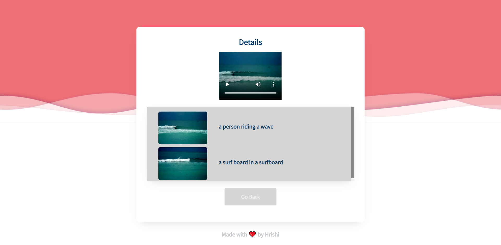

# Video Summarization

Implemented a video summarization system. The system takes a video as an input and outputs unique frames along with their captions.

Note: This project is still work-in-progress. Currently, the frontend uses BEAM search by default with width 3. For now, you can change it at `/frontent/src/components/VidCap/VidCap.js`. 

## How to run?

This repository is divided into three components. The frontend, which is created using ReactJS, the backend, made with flask which servers our Tensorflow model, and the training notebook. You don't have to retrain, you can use my trained checkpoints instead: https://drive.google.com/drive/folders/1aUEPjykLXqI_K70o09fFjreOkSCF8H_l?usp=sharing

Put the checkpoint files at `backend/ckpt/ckpt6/`. You can change the directory and checkpoint in `backend/utils.py`

Change `UPLOAD_FOLDER` to your desired location in `backend/server.py`

1) Start the backend.
* `cd backend`
* `python server.py`

2) Start the frontend.
* `cd frontend`
* `npm i`
* `npm start`
